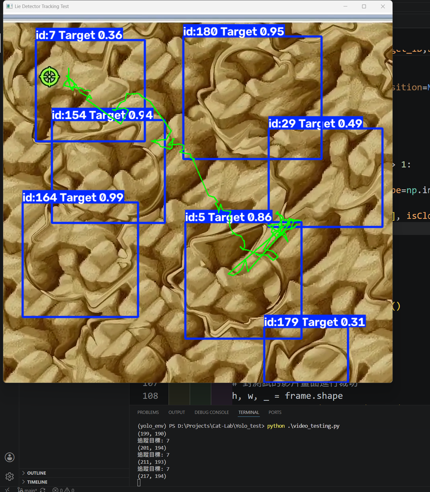

# Experiment Note

* 訓練basic_model : yolo_8
* 訓練樣本: 一種圖形的三張標註圖片
* 訓練步數: epochs=50,batch=16

# Experiment Img
<table>
  <tr>
    <td align="center">
      
       
      <em></em>
    </td>
  </tr>
</table>