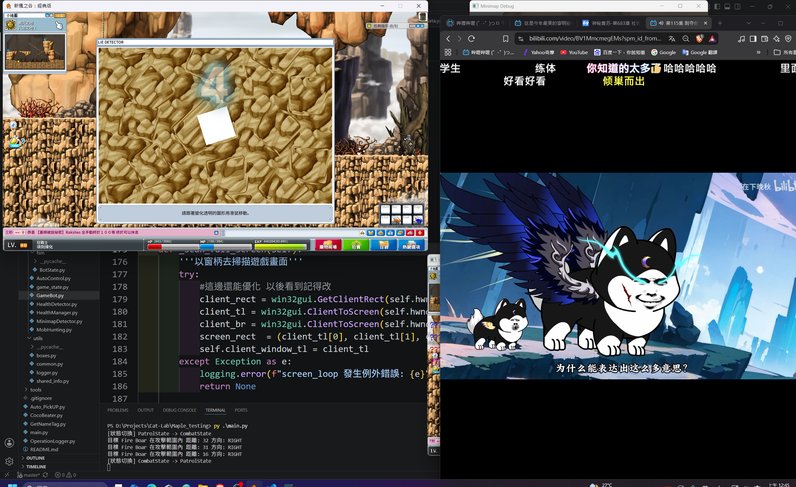
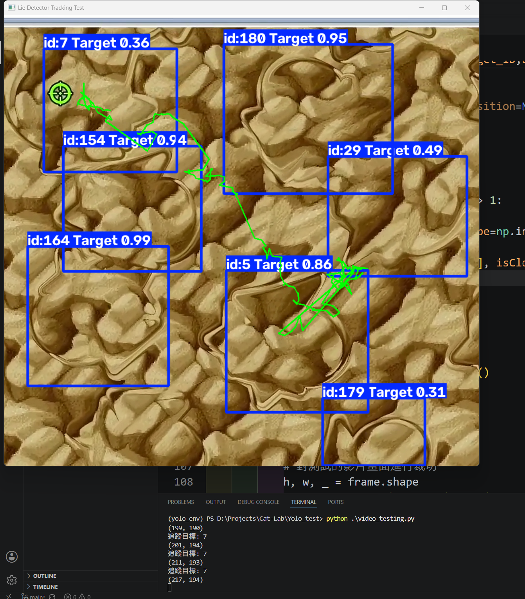
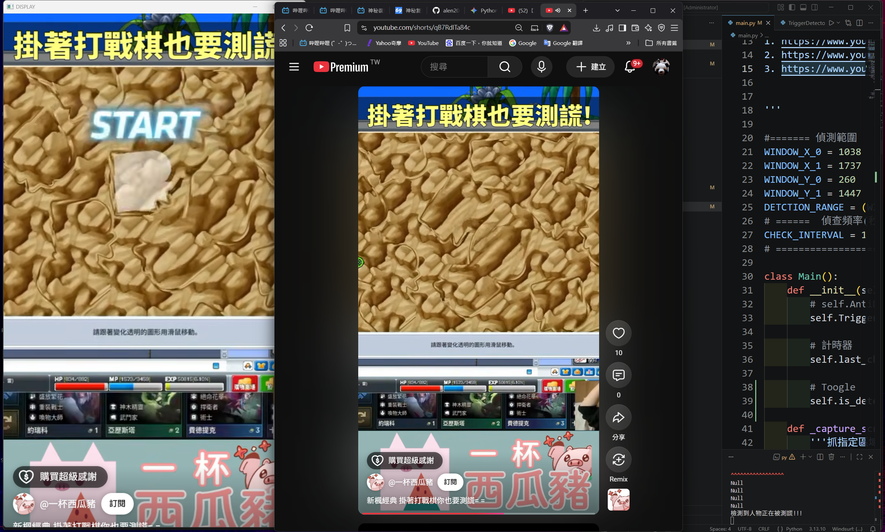
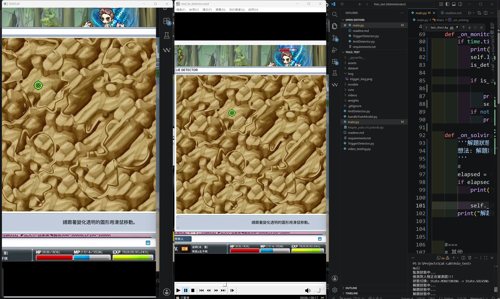

# Experiment Note

* 訓練basic_model : yolo_8
* 訓練樣本: 一種圖形的三張標註圖片
* 訓練步數: epochs=50,batch=16
* [NOTE]  cv2 + 光流 + 卡爾曼濾波 : False; 卡爾曼濾波是慣性預測，隨機運動抓不到；光流會累積誤差，幾次後就飄了 yolo+ ByteTrack: nullptr ;  yolo + OC-SORT: 效果比較好，ocsort有追朔修正(失聯前一幀)，多目標時以運動慣性做短追蹤+分辨

* [NOTE] 思路i: 以前三秒白色目標時做定位在MOT時鎖定；思路ii:得到目標後，以前幀目標[x0:x1,y0:y1]+buffer 附近作追蹤，而不做多目標

* [NOTE] 視窗資料:
 　`測試環境`
 　螢幕解析度：2560 x 1600 　DPI 縮放比例：125% 　遊戲視窗:1366*768 
 　`遊戲物件`
 　遊戲窗口:窗口左上點為(0,0)；右下點大約(1372,802) 
 　偵測小遊戲窗口:大約左上為(132,121)；右下(1069,715);長約940像素；寬約600像素
 　ORC文字捕捉目標:捕捉小遊戲窗口下面那一長串字 　　　左上點(577,672)；右下點(800,700)
<table>
  <tr>
    <td align="center">
      
       
      <em>Yolo檢測</em>
    </td>
  </tr>
</table>

# Experiment Img
<table>
  <tr>
    <td align="center">
      
       
      <em>Yolo檢測</em>
    </td>
  </tr>
</table>
<table>
  <tr>
    <td align="center">
      
       
      <em>OCR偵測被測謊</em>
    </td>
  </tr>
</table>
<table>
  <tr>
    <td align="center">
      
       
      <em>State切換</em>
    </td>
  </tr>
</table>